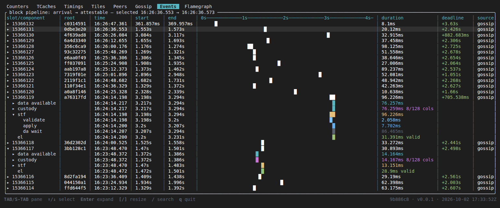
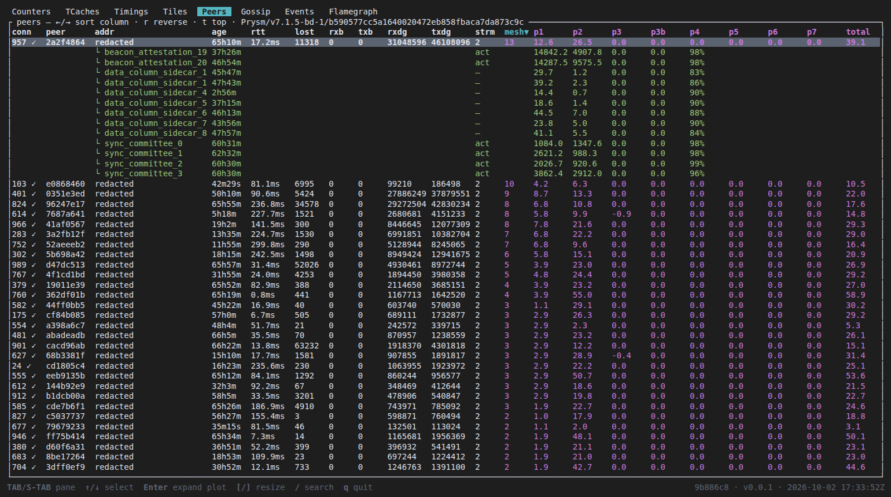
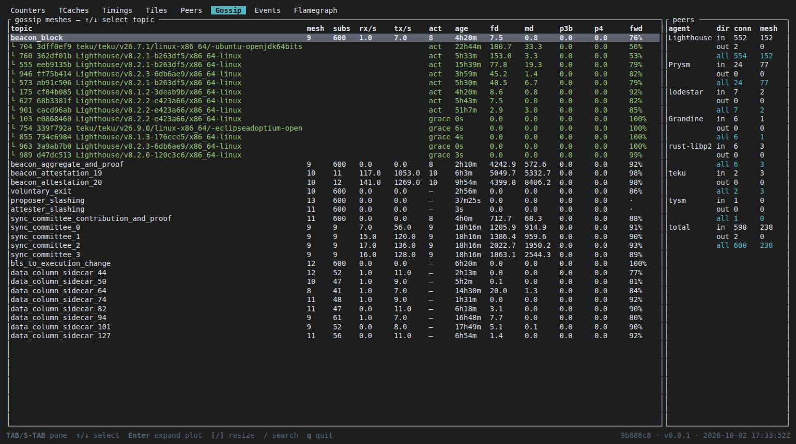
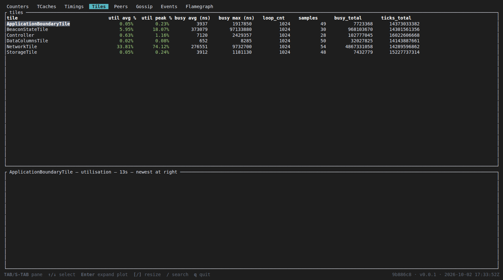

# Silver Surfer


A live terminal dashboard for a Silver node. Run it on the node's machine, as
the same user:

```bash
./silver_surfer
```

Take it from the same release as `silver`; another version may misread the
node. `Tab` / `Shift-Tab` switch tabs, `↑` / `↓` select a row, `Enter` opens
it, `/` searches, and `q` quits.

## Events

This tab shows how fast Silver makes each block ready to attest to. As of
Fulu, validators must attest within 4 s of the slot start.

There is one row per block, newest on top. The bar runs from the block's
arrival to the moment it was ready, on a time-into-slot axis.



| Column | Meaning |
|---|---|
| `start` / `end` | Arrival and attestable time, counted from the slot start |
| `duration` | How long the node took from arrival to attestable |
| `deadline` | Time left before the 4 s attestation deadline: green made it, red missed |
| `source` | `gossip`, or `rpc` when the node had to fetch the block |

`Enter` splits a block into its stages: `data available`, `stf` (state
transition) and `el` (execution client verdict: valid, syncing or invalid).
`stf` opens further into `validate`, `apply` and `da wait`: the time spent
waiting for the block's data columns to arrive.

**Look for:** a new row every 12 s, durations in tens of milliseconds, and
green deadlines. A slow `el` stage points at the execution client.

## Peers

One row per connected peer. Selecting a peer lists the topics it shares with
the node, and the title names its client.



| Column | Meaning |
|---|---|
| `conn` | Connection id; `✓` marks a peer that dialled in |
| `age`, `rtt`, `lost` | Connection age, round-trip time, lost packets |
| `mesh` | Topics where the peer is in the node's gossip mesh |
| `p1`…`p7`, `total` | Gossipsub score parts and their sum |

The score parts:

- `p1`: time in mesh
- `p2`: first deliveries
- `p3` / `p3b`: missed mesh deliveries
- `p4`: invalid messages
- `p5`: application score
- `p6`: shared IP
- `p7`: misbehaviour

**Look for:** dozens of peers, and positive totals. Negative `p3b` or `p4`
marks a peer that drops or sends invalid messages. `←` / `→` sort by another
column, `r` reverses the sort, and `t` scrolls to the top.

## Gossip

One row per subscribed topic; selecting one lists its mesh peers. The side panel
counts connections and mesh slots per client.



| Column | Meaning |
|---|---|
| `mesh`, `subs` | Peers in the topic's mesh, and peers subscribed to it |
| `rx/s`, `tx/s` | Messages received and sent per second |
| `fd`, `md` | Median first and mesh deliveries of the mesh peers |
| `p3b`, `p4` | Total mesh penalties for missed deliveries and invalid messages |

**Look for:** a full mesh (about 8 peers) on every topic, and steady `rx/s` on
`beacon_block`, attestation and sync committee topics. The side panel shows
the client mix the node talks to.

## Tiles

Silver runs as a few worker threads, called tiles. Each row is one tile; the
lower half plots the selected tile's load over time.



| Column | Meaning |
|---|---|
| `util avg %`, `util peak %` | Share of time the tile was busy |
| `busy avg`, `busy max` | Average and worst busy time per sample, in nanoseconds |

## Other tabs

- **Counters**: raw node counters with history; `Enter` plots one.
- **TCaches**: fill level and throughput of each shared-memory buffer.
- **Timings**: latency and processing time per timer (p50, p99, max).
- **Flamegraph**: a live CPU profile of the node; `p` pauses it, `c` clears it.

## For developers

### Timing functions and methods

The `#[timed]` attribute macro (from `silver_common`) can be used to create timers for functions and methods.

### Counters

Counters are defined using the `declare_counters!` macro from `silver_common`. For example:

```
silver_common::declare_counters! {
    pub NetworkCounters => "network" {
        DiscBytesRecv,
        DiscBytesSent,
        P2pBytesRecv,
        P2pBytesSent,
        P2pConnections,
    }
}
```

The `lookup` function `schema.rs` file in `silver_surfer` crate must all be updated:
```
/// Map from file suffix (the `{name}` in `counters-{name}`) to the
/// variant name array. Add lines here as silver crates declare counter
/// enums via `silver_common::declare_counters!`.
pub fn lookup(file_name: &str) -> Option<&'static [&'static str]> {
    match file_name {
        "storage" => Some(silver_storage::StorageCounters::NAMES),
        "network" => Some(silver_network::NetworkCounters::NAMES),
        _ => None,
    }
}
```

Use the `dec()` method of counters with caution - this will overflow if called on a counter with a zero value. For gauge like use of counters `set()` may be a better option.
