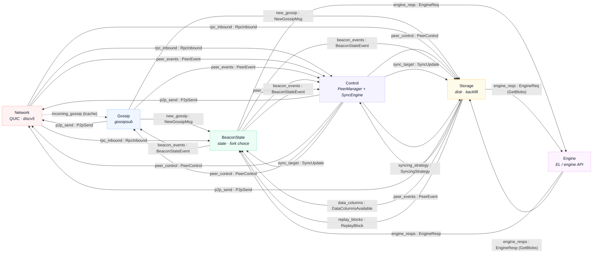

# Spine message flow between tiles

Silver's six tiles communicate over **spine queues** — typed SPMC channels declared in
`crates/common/src/spine.rs`. Small typed messages travel on the queues; bulk payloads
live in **tcaches** (shared-memory rings) and queue messages carry `TCacheRead` refs into
them (see [tcaches](#tcaches)).

The tiles: **Network** (QUIC + discv5), **Gossip** (gossipsub decode/encode), **Control**
(`PeerManager` + `SyncEngine`), **BeaconState** (state transition + fork choice),
**Storage** (disk + backfill), **Engine** (EL / engine API).

Solid arrows are spine queues (`queue : MessageType`), one per consumer since queues are
SPMC. The dashed edge is the exception: `incoming_gossip` is the *tcache* carrying raw
protobuf Network → Gossip (no spine queue on that hop — Gossip's queued output is
`new_gossip`). `engine_health` is omitted from the diagram: Engine produces it but no
tile currently consumes it. Both Storage↔Engine edges carry only the
`GetBlobs` variants (EL-mempool blob fetch); the queues are broadcast, so Storage sees
every `EngineResp` and ignores the rest.

## Spine queues

| Queue | Message | Producer(s) | Consumer(s) | Carries |
|-------|---------|-------------|-------------|---------|
| `new_gossip` | `NewGossipMsg` | Gossip | BeaconState, Storage | refs → `incoming_gossip`, `ssz_gossip` |
| `p2p_send` | `P2pSend` | Gossip, Control, Storage | Network | refs → `outgoing_gossip` / `outgoing_rpc` |
| `rpc_inbound` | `RpcInbound` | Network | Control, BeaconState, Storage | ref → `incoming_rpc` |
| `peer_events` | `PeerEvent` | Network, Gossip, Storage, BeaconState | Control | inline |
| `peer_control` | `PeerControl` | Control | Network, Gossip, Storage | inline |
| `beacon_events` | `BeaconStateEvent` | BeaconState | Control, Gossip, Storage | inline |
| `data_columns` | `DataColumnsAvailable` | Storage | BeaconState | inline |
| `sync_target` | `SyncUpdate` | Control | BeaconState, Storage | inline |
| `replay_blocks` | `ReplayBlock` | Storage | BeaconState | ref → `replay_blocks` tcache |
| `syncing_strategy` | `SyncingStrategy` | Control | Storage | inline |
| `engine_reqs` | `EngineReq` | BeaconState, Storage _(GetBlobs)_ | Engine | refs → `ssz_gossip` / `incoming_rpc`; GetBlobs inline |
| `engine_resps` | `EngineResp` | Engine | BeaconState, Storage _(GetBlobs)_ | ref → `incoming_engine_resp` |
| `engine_health` | `EngineHealthEvent` | Engine | _none (currently unconsumed)_ | inline |

## TCaches

Bulk-byte rings that the queue messages reference, so payloads cross tiles without copying.

| TCache | Producer | Consumer(s) | Payload |
|--------|----------|-------------|---------|
| `incoming_gossip` | Network | Gossip | raw gossipsub protobuf from the wire |
| `ssz_gossip` | Gossip | BeaconState, Storage (live + persist), Engine | decompressed gossip SSZ |
| `outgoing_gossip` | Gossip | Network | protobuf to publish / re-broadcast |
| `incoming_rpc` | Network | BeaconState, Storage (live + persist), Engine | RPC response bodies (BeaconBlock / DataColumnSidecar) |
| `outgoing_rpc` _(multi-producer)_ | Control, Storage | Network | RPC request bodies (we ask) + served response bodies (we answer) |
| `replay_blocks` | Storage | BeaconState | persisted block SSZ replayed at startup |
| `incoming_engine_resp` | Engine | BeaconState, Storage (GetBlobs) | EL responses (payloads, blobs, bodies) |

---

Source of truth: `crates/common/src/spine.rs` (queue declarations), `crates/bin/src/main.rs`
(tcache producer/consumer wiring), and each tile's `loop_body`. Regenerate when the spine
changes.
