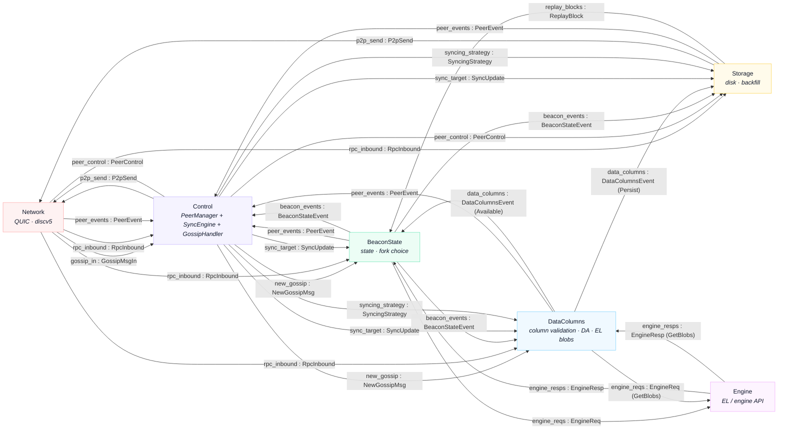

# Spine message flow between tiles

Silver's six tiles communicate over **spine queues** — typed SPMC channels declared in
`crates/common/src/spine.rs`. Small typed messages travel on the queues; bulk payloads
live in **tcaches** (shared-memory rings) and queue messages carry `TCacheRead` refs into
them (see [tcaches](#tcaches)).

The tiles: **Network** (QUIC + discv5), **Control** (`PeerManager` + `SyncEngine` +
`GossipHandler` — gossipsub decode/encode runs in-tile, not as its own tile),
**BeaconState** (state transition + fork choice), **Storage** (disk + backfill),
**Engine** (EL / engine API), **DataColumns** (column validation, DA tracking,
EL blob fetch — split out of Storage).

Solid arrows are spine queues (`queue : MessageType`), one per consumer since queues are
SPMC. The gossip handler's other traffic is in-tile, not on the spine: its `PeerEvent`s
(gossipsub scoring/misbehaviour) go straight to the `PeerManager`, `PeerControl` is
forwarded to the handler directly, and its fork digest is set from the `Status` Control
already consumes. Two queues are omitted from the diagram: `engine_health` (Engine
produces it, no tile consumes it) and `peer_stats` (Network produces connection stats,
Control produces score breakdowns; consumed out-of-process by surfer's Peers tab, which
joins the spine as a broadcast reader the same way its Events pane does). The
DataColumns↔Engine edges carry only the `GetBlobs` variants (EL-mempool blob fetch); the
queues are broadcast, so DataColumns sees every `EngineResp` and ignores the rest.

## Spine queues

| Queue | Message | Producer(s) | Consumer(s) | Carries |
|-------|---------|-------------|-------------|---------|
| `gossip_in` | `GossipMsgIn` | Network | Control _(gossip)_ | ref → `incoming_gossip` |
| `new_gossip` | `NewGossipMsg` | Control _(gossip)_ | BeaconState, DataColumns | refs → `outgoing_gossip` (mcache copy), `ssz_gossip` |
| `p2p_send` | `P2pSend` | Control, Storage | Network | refs → `outgoing_gossip` / `outgoing_rpc` |
| `rpc_inbound` | `RpcInbound` | Network | Control, BeaconState, Storage, DataColumns | ref → `incoming_rpc` |
| `peer_events` | `PeerEvent` | Network, BeaconState, Storage, DataColumns | Control | mostly inline; `SendGossip` ref → `outgoing_gossip`, `PublishDataColumn` ref → `incoming_rpc` |
| `peer_control` | `PeerControl` | Control | Network, Storage | inline |
| `beacon_events` | `BeaconStateEvent` | BeaconState | Control, Storage, DataColumns | mostly inline; `PersistBlock`/`PersistEnvelope` refs → `ssz_gossip` / `incoming_rpc` (by source) |
| `data_columns` | `DataColumnsEvent` | DataColumns | BeaconState _(Available)_, Storage _(Persist)_ | `Available` inline; `Persist` ref → `ssz_gossip` / `incoming_rpc` / `el_data_columns` (by `ColumnSource`) |
| `sync_target` | `SyncUpdate` | Control | BeaconState, Storage, DataColumns | inline |
| `replay_blocks` | `ReplayBlock` | Storage | BeaconState | ref → `replay_blocks` tcache |
| `syncing_strategy` | `SyncingStrategy` | Control | Storage, DataColumns | inline |
| `engine_reqs` | `EngineReq` | BeaconState, DataColumns _(GetBlobs)_ | Engine | refs → `ssz_gossip` / `incoming_rpc`; GetBlobs inline |
| `engine_resps` | `EngineResp` | Engine | BeaconState, DataColumns _(GetBlobs)_ | ref → `incoming_engine_resp` |
| `engine_health` | `EngineHealthEvent` | Engine | _none (currently unconsumed)_ | inline |
| `peer_stats` | `PeerStats` | Network _(P2p)_, Control _(Scores, Topic)_ | _none in-process (surfer)_ | inline |

## TCaches

Bulk-byte rings that the queue messages reference, so payloads cross tiles without copying.

| TCache | Producer | Consumer(s) | Payload |
|--------|----------|-------------|---------|
| `incoming_gossip` | Network | Control _(gossip, random access)_ | raw gossipsub protobuf from the wire |
| `ssz_gossip` | Control _(gossip)_ | BeaconState, DataColumns (live + persist), Storage (persist), Engine | decompressed gossip SSZ |
| `outgoing_gossip` | Control _(gossip)_ | Network | gossip protobuf: mcache copies of incoming messages, local publishes, IDONTWANT/IWANT control frames |
| `incoming_rpc` | Network | BeaconState, DataColumns (live + persist), Storage (live + persist), Engine, Control (column republish) | RPC response bodies (BeaconBlock / DataColumnSidecar) |
| `outgoing_rpc` _(multi-producer)_ | Control, Storage | Network | RPC request bodies (we ask) + served response bodies (we answer) |
| `replay_blocks` | Storage | BeaconState | persisted block SSZ replayed at startup |
| `incoming_engine_resp` | Engine | BeaconState, DataColumns (GetBlobs) | EL responses (payloads, blobs, bodies) |
| `el_data_columns` | DataColumns | Storage | column sidecars reconstructed from EL-mempool blobs |

---

Source of truth: `crates/common/src/spine.rs` (queue declarations), `crates/bin/src/main.rs`
(tcache producer/consumer wiring), and each tile's `loop_body`. Regenerate when the spine
changes.
