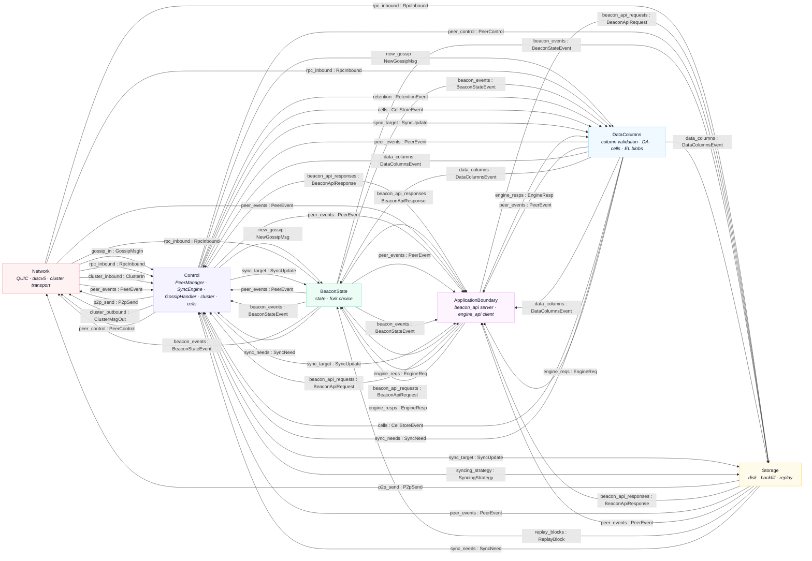

# Spine message flow between tiles

Silver's six tiles communicate over **spine queues**: typed SPMC broadcast channels declared
in `crates/common/src/spine.rs`. Small typed messages travel on the queues. Bulk payloads
live in **tcaches** (shared-memory rings), and queue messages carry `TCacheRead` refs into
them (see [TCaches](#tcaches)).

The tiles, by their `Tile::name()` (the name flux gives their `tilemetrics-*` and
`latency-*`/`timing-*` files):

| Tile | Crate | Role |
|------|-------|------|
| `NetworkTile` | `network` | QUIC p2p, discv5, attestation-cluster transport |
| `Controller` | `control` | `PeerManager`, `SyncEngine`, in-tile `GossipHandler`, attestation Raft cluster, cell ingress and partial-column exchange, local-gossip submissions |
| `BeaconStateTile` | `beacon_state/tile` | state transition, fork choice, gossip validation, op pools |
| `StorageTile` | `storage` | disk store, RPC serving, backfill, replay, peer persistence |
| `DataColumnsTile` | `columns` | column and KZG validation, cell store, EL `getBlobs` fetch |
| `ApplicationBoundaryTile` | `application_boundary` | one readiness loop hosting the `beacon_api` server and the `engine_api` client |

```mermaid
flowchart LR
  NET["Network<br/><i>QUIC · discv5 · cluster transport</i>"]
  CTL["Control<br/><i>PeerManager · SyncEngine · GossipHandler · cluster · cells</i>"]
  BS["BeaconState<br/><i>state · fork choice</i>"]
  ST["Storage<br/><i>disk · backfill · replay</i>"]
  AB["ApplicationBoundary<br/><i>beacon_api server · engine_api client</i>"]
  DC["DataColumns<br/><i>column validation · DA · cells · EL blobs</i>"]

  %% ---- inbound ----
  NET -->|gossip_in : GossipMsgIn| CTL
  CTL -->|new_gossip : NewGossipMsg| BS
  CTL -->|new_gossip : NewGossipMsg| DC
  NET -->|rpc_inbound : RpcInbound| CTL
  NET -->|rpc_inbound : RpcInbound| BS
  NET -->|rpc_inbound : RpcInbound| DC
  NET -->|rpc_inbound : RpcInbound| ST

  %% ---- outbound ----
  CTL -->|p2p_send : P2pSend| NET
  ST -->|p2p_send : P2pSend| NET

  %% ---- attestation cluster ----
  NET -->|cluster_inbound : ClusterIn| CTL
  CTL -->|cluster_outbound : ClusterMsgOut| NET

  %% ---- beacon API ----
  AB -->|beacon_api_requests : BeaconApiRequest| CTL
  AB -->|beacon_api_requests : BeaconApiRequest| BS
  AB -->|beacon_api_requests : BeaconApiRequest| ST
  CTL -->|beacon_api_responses : BeaconApiResponse| AB
  BS -->|beacon_api_responses : BeaconApiResponse| AB
  ST -->|beacon_api_responses : BeaconApiResponse| AB

  %% ---- peer management ----
  NET -->|peer_events : PeerEvent| CTL
  NET -->|peer_events : PeerEvent| AB
  CTL -->|peer_events : PeerEvent| AB
  BS -->|peer_events : PeerEvent| CTL
  BS -->|peer_events : PeerEvent| AB
  DC -->|peer_events : PeerEvent| CTL
  DC -->|peer_events : PeerEvent| AB
  ST -->|peer_events : PeerEvent| CTL
  ST -->|peer_events : PeerEvent| AB
  CTL -->|peer_control : PeerControl| NET
  CTL -->|peer_control : PeerControl| ST

  %% ---- chain state & DA ----
  BS -->|beacon_events : BeaconStateEvent| CTL
  BS -->|beacon_events : BeaconStateEvent| NET
  BS -->|beacon_events : BeaconStateEvent| ST
  BS -->|beacon_events : BeaconStateEvent| DC
  BS -->|beacon_events : BeaconStateEvent| AB
  DC -->|data_columns : DataColumnsEvent| CTL
  DC -->|data_columns : DataColumnsEvent| BS
  DC -->|data_columns : DataColumnsEvent| ST
  DC -->|data_columns : DataColumnsEvent| AB
  ST -->|replay_blocks : ReplayBlock| BS

  %% ---- cell store ----
  CTL -->|retention : RetentionEvent| DC
  CTL -->|cells : CellStoreEvent| DC
  DC -->|cells : CellStoreEvent| CTL

  %% ---- sync control ----
  CTL -->|sync_target : SyncUpdate| BS
  CTL -->|sync_target : SyncUpdate| DC
  CTL -->|sync_target : SyncUpdate| ST
  CTL -->|sync_target : SyncUpdate| AB
  BS -->|sync_needs : SyncNeed| CTL
  DC -->|sync_needs : SyncNeed| CTL
  ST -->|sync_needs : SyncNeed| CTL
  CTL -->|syncing_strategy : SyncingStrategy| ST

  %% ---- engine / EL ----
  BS -->|engine_reqs : EngineReq| AB
  DC -->|engine_reqs : EngineReq| AB
  AB -->|engine_resps : EngineResp| BS
  AB -->|engine_resps : EngineResp| DC

  classDef net fill:#fef2f2,stroke:#fca5a5,color:#0f172a;
  classDef ctl fill:#f5f3ff,stroke:#c4b5fd,color:#0f172a;
  classDef bs  fill:#ecfdf5,stroke:#6ee7b7,color:#0f172a;
  classDef st  fill:#fffbeb,stroke:#fcd34d,color:#0f172a;
  classDef ab  fill:#fdf4ff,stroke:#f0abfc,color:#0f172a;
  classDef dc  fill:#f0f9ff,stroke:#7dd3fc,color:#0f172a;
  class NET net; class CTL ctl; class BS bs; class ST st; class AB ab; class DC dc;
```

Arrows are spine queues (`queue : MessageType`), one per producer–consumer pair.
Queues are broadcast: every consumer reads every message and filters in its handler.
Self-edges are not drawn:

- `ApplicationBoundary` consumes its own `engine_resps` (`NewPayload`, for the beacon API).
- `Control` and `DataColumns` each produce and consume `cells`.

Two queues have no in-process consumer and are omitted:

- `engine_health`, produced by ApplicationBoundary.
- `peer_stats`, produced by Network (`P2p`) and Control (`Scores`, `Topic`). The telemetry
  exporter and surfer's Peers tab read it out of process as broadcast readers.

The `GossipHandler`'s own `PeerEvent`s (scoring, misbehaviour) do not go on the spine.
Control handles them in-tile.

## Spine queues

| Queue | Message | Producer(s) | Consumer(s) | Notes |
|-------|---------|-------------|-------------|-------|
| `gossip_in` | `GossipMsgIn` | Network | Control _(gossip)_ | ref → `NetworkIngress` |
| `new_gossip` | `NewGossipMsg` | Control _(gossip)_ | BeaconState, DataColumns | DataColumns acts on block and column topics only, and only when synced; ref → `ControlProcessing` |
| `p2p_send` | `P2pSend` | Control, Storage | Network | Control: gossip, RPC requests, partial-column exchange; Storage: RPC responses |
| `rpc_inbound` | `RpcInbound` | Network | Control, BeaconState, DataColumns, Storage | BeaconState and DataColumns: live responses; Storage: all requests (serving) and backfill responses; ref → `NetworkProcessing` |
| `cluster_inbound` | `ClusterIn` | Network | Control | Raft messages, and `NodeUnreachable` on a failed send; ref → `ClusterInbound` |
| `cluster_outbound` | `ClusterMsgOut` | Control | Network | ref → `ClusterOutbound` |
| `beacon_api_requests` | `BeaconApiRequest` | ApplicationBoundary | Control, BeaconState, Storage | Control: local gossip, committee subscriptions; BeaconState: aggregates, sync contributions (Following only); Storage: blocks |
| `beacon_api_responses` | `BeaconApiResponse` | Control, BeaconState, Storage | ApplicationBoundary | BeaconState refs → `BeaconStateHandoff`; Storage block bytes → `StorageDelivery` |
| `peer_events` | `PeerEvent` | Network, Control, BeaconState, DataColumns, Storage | Control, ApplicationBoundary | ApplicationBoundary takes connects, disconnects, and `SendGossip` for blocks and attestations |
| `peer_control` | `PeerControl` | Control | Network, Storage | Storage: `PersistPeer` only; request variants never reach the queue (Control turns them into `p2p_send`) |
| `beacon_events` | `BeaconStateEvent` | BeaconState | Control, Network, Storage, DataColumns, ApplicationBoundary | Network: `Status` only (ENR fork id) |
| `data_columns` | `DataColumnsEvent` | DataColumns | Control, BeaconState, Storage, ApplicationBoundary | BeaconState: `Available`; Storage and Control: `Persist`; ApplicationBoundary: `Validated` |
| `retention` | `RetentionEvent` | Control | DataColumns | only with cells configured |
| `cells` | `CellStoreEvent` | Control, DataColumns | Control, DataColumns | refs → `ControlSlot` |
| `sync_target` | `SyncUpdate` | Control | BeaconState, DataColumns, Storage, ApplicationBoundary | inline |
| `sync_needs` | `SyncNeed` | Control, BeaconState, DataColumns, Storage | Control | into `SyncEngine::on_sync_need` |
| `replay_blocks` | `ReplayBlock` | Storage | BeaconState | ref → `StorageDelivery` |
| `syncing_strategy` | `SyncingStrategy` | Control | Storage | inline |
| `engine_reqs` | `EngineReq` | BeaconState, DataColumns _(GetBlobs)_ | ApplicationBoundary | `NewPayload`/`Fcu` refs → `ControlProcessing` / `NetworkProcessing` |
| `engine_resps` | `EngineResp` | ApplicationBoundary | BeaconState, DataColumns _(GetBlobs)_, ApplicationBoundary _(NewPayload)_ | ref → `BoundaryProcessing` |
| `engine_health` | `EngineHealthEvent` | ApplicationBoundary | _none_ | inline |
| `peer_stats` | `PeerStats` | Network _(P2p)_, Control _(Scores, Topic)_ | _none in-process_ | out of process: telemetry exporter, surfer |

The dashboard's Flow tab (`crates/dashboard/web/flow.js`, `QUEUES`) holds this table as
its producer map, since producers are not observable on the spine. Update both together.

## TCaches

Bulk-byte rings (`TCacheId`, `crates/common/src/spine/tcache/id.rs`) that queue messages
reference, so payloads cross tiles without copying. Producers are created in
`crates/bin/src/main.rs`; consumers open their readers in each tile's `try_init`.

| TCache | Producer | Consumer(s) | Payload |
|--------|----------|-------------|---------|
| `NetworkIngress` | Network | Control _(gossip)_ | raw inbound gossip frames: stream id and protobuf |
| `NetworkProcessing` | Network | Control, BeaconState, DataColumns (live + persist), Storage (live + persist), ApplicationBoundary | inbound RPC request and response SSZ |
| `ClusterInbound` | Network | Control | inbound Raft messages |
| `ControlProcessing` | Control _(gossip)_ | BeaconState, DataColumns (live + persist), Storage (persist), ApplicationBoundary | decoded gossip SSZ |
| `ControlGossip` | Control _(gossip)_ | Control _(mcache)_, DataColumns, Network | outbound gossip protobuf frames and mcache |
| `ControlRpc` | Control | Network | outbound RPC request bodies |
| `ClusterOutbound` | Control | Network | encoded outbound Raft messages |
| `ControlSlot` | Control _(cell ingress)_ | DataColumns, BeaconState, Storage (persist), ApplicationBoundary, Network _(partial columns only)_ | per-slot cell store: partial-column cells and assembled columns |
| `StorageDelivery` | Storage | Network, BeaconState, ApplicationBoundary | RPC response bodies served from disk, replay block SSZ, beacon API block bytes |
| `BoundaryProcessing` | ApplicationBoundary | Control, BeaconState, DataColumns | beacon API submissions (local-gossip SSZ) and engine responses |
| `BeaconStateHandoff` | BeaconState | ApplicationBoundary | aggregate attestation and sync contribution SSZ, attester shuffling indices |

BeaconState and DataColumns forward reads of `ControlProcessing` and `NetworkProcessing`;
DataColumns also forwards `ControlGossip` and `ControlSlot`
(`crates/common/src/spine/tcache/emitters.rs`).

Unverified:

- Which code in BeaconState reads `ControlSlot`, which it opens.
- The exact payload behind the `BoundaryProcessing` reads by Control and BeaconState.

---

Source of truth: `crates/common/src/spine.rs` (queue declarations), `crates/bin/src/main.rs`
(tile and tcache wiring), and each tile's `loop_body`. Regenerate when the spine changes.
