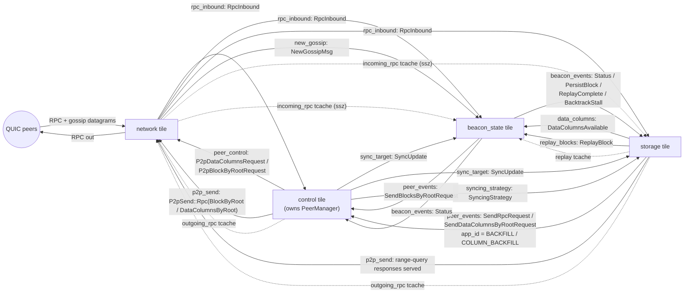

# Sync & backfill message flow

Reference for how block and data-column **syncing** (live catch-up) and
**backfilling** (historical fill) move across the tiles, over spine queues and
tcaches. Captured as the starting point for unifying this logic — today it is
split across the **storage tile** and the **control tile / peer manager**.

Mermaid renders on GitHub / VS Code. Diagrams cover only the sync/backfill
subset; gossip-scoring, identify, discovery and engine-API edges are omitted.

## 1. Message flow — spine queues (solid) + tcaches (dashed)



## 2. Storage backfill phase machine (`BlockBackfillStage`)

Column backfill runs to completion *before* block backfill (so an
already-block-synced node still fetches missing columns — see
`docs/` and `store/backfill.rs`). `EarliestSlot` drops to the column floor only
once both phases finish, so servable column history is never over-advertised.

```mermaid
stateDiagram-v2
  [*] --> Idle
  Idle --> AwaitingColumns: "SyncUpdate::Following (1st) → queue ColumnBackfillScan"
  AwaitingColumns --> Queued: "disk scan done && column set-1 drained → queue Backfill"
  Queued --> Running: "Backfill::start → BlocksByRange (app_id = BACKFILL)"
  Running --> Done: "all block ranges drained"
  Done --> Idle: "column set-2 drained → emit EarliestSlot(floor)"
```

Column-backfill seed sources:

- **set 1** — disk scan of persisted blocks in the column-retention window
  (`scan_columns_step`), for blocks whose custody columns are absent.
- **set 2** — blocks fetched by block backfill that fall in the column window
  (`Backfill::add_block` → `ColumnBackfill::seed_block`).

Concurrency is bounded: at most `MAX_COLUMN_REQUESTS_IN_FLIGHT` (4)
`DataColumnsByRoot` requests outstanding, drained from a FIFO backlog; a timing
wheel (`COLUMN_REQUEST_WHEEL_*`) is both the in-flight set and the retry timer.

## 3. Request / response correlation

Responses are demultiplexed by the high-32-bit prefix of `application_id`.

| `application_id` prefix | Issued by | Outbound RPC | Response routed to |
|---|---|---|---|
| `BASE_REQUEST_ID` (`0x00da5da5`) | storage (live by-root), PM (live by-range) | `DataColumnsBy*` | storage `data_columns()` — `is_live_column_request` |
| `BACKFILL_REQUEST_ID` (`0xbaccf111`) | storage `Backfill` | `BlocksByRange` | storage `backfill_block()` — `is_backfill` |
| `COLUMN_BACKFILL_REQUEST_ID` (`0xc01baccf`) | storage `ColumnBackfill` | `DataColumnsByRoot` | storage `backfill_data_column()` — `is_column_backfill` |
| `start_slot` (peer-local) | PM `maybe_issue_syncreq` / `maybe_issue_colreq` | `BlocksByRange` / `DataColumnsByRange` | PM `inflight_syncreq` / `col_syncreq` |

## 4. Spine queues (sync/backfill subset)

| Queue | Message | Producers | Consumers |
|---|---|---|---|
| `new_gossip` | `NewGossipMsg` | network | gossip, beacon_state |
| `rpc_inbound` | `RpcInbound` | network | control, beacon_state, storage |
| `peer_events` | `PeerEvent` | network, gossip, storage | control |
| `peer_control` | `PeerControl` | control | network, gossip |
| `p2p_send` | `P2pSend` | control, gossip, beacon_state, storage | network |
| `beacon_events` | `BeaconStateEvent` | beacon_state | control, gossip, storage, engine |
| `sync_target` | `SyncUpdate` | control | beacon_state, storage |
| `syncing_strategy` | `SyncingStrategy` | control | storage |
| `data_columns` | `DataColumnsAvailable` | storage | beacon_state |
| `replay_blocks` | `ReplayBlock` | storage | beacon_state |

tcaches in play: `incoming_rpc` (network → beacon_state, storage), `ssz_gossip`
(gossip → beacon_state, storage), `outgoing_rpc` (control, storage → network),
`replay` (storage → beacon_state).

Relevant message variants:

- `SyncUpdate` — `SyncingFinalized { target_epoch, target_root }`,
  `SyncingHead { head_root, head_slot }`, `Following`.
- `SyncingStrategy` — `SyncFromPeers`, `ReplayDisk`.
- `ReplayBlock` — `Block { ssz }`, `Done`.
- `DataColumnsAvailable` — `{ block_root, slot }`.

## 5. The split (target of the refactor)

The control-flow for one backfill request crosses the tile boundary twice
(storage → control → network → peer → network → storage), demuxed by
`application_id` prefix. The two owners:

**Peer manager (control tile)** — *live* sync:

- Target selection from peer `Status` (`finalized_counts` / `head_counts` →
  `SyncUpdate`); pin invariant + `target_dirty` / `burnt_for_target`.
- Live `BlocksByRange` (`maybe_issue_syncreq`, `synced_through`) and
  `DataColumnsByRange` (`maybe_issue_colreq`, `columns_synced_through`) issuance
  and in-flight state (`inflight_syncreq`, `col_syncreq`).
- Peer ranking (`best_peer_for_data_columns`), outbound capacity / rate-limit.
- **Routing storage's by-root/by-range requests** to peers (`on_request_*`,
  `pending_*` queues, `outbound_range_attempts`), and response classification.

**Storage tile** — *historical* backfill + validation:

- `ColumnBackfill` / `Backfill` engines, disk scan, `BlockBackfillStage`.
- All block/column validation (BLS, KZG proofs, inclusion proof, state checks).
- By-root retry wheels, `EarliestSlot`, disk persistence + replay.

**Control tile** — lifecycle only: owns the PeerManager, drives ticks/fan-outs,
marshals `PeerEvent` / `RpcInbound` into it, allocates RPC tcache.

The seam a unified sync component would absorb: **live-sync targeting + request
routing (PM) ⟷ backfill engines + validation (storage)**.
