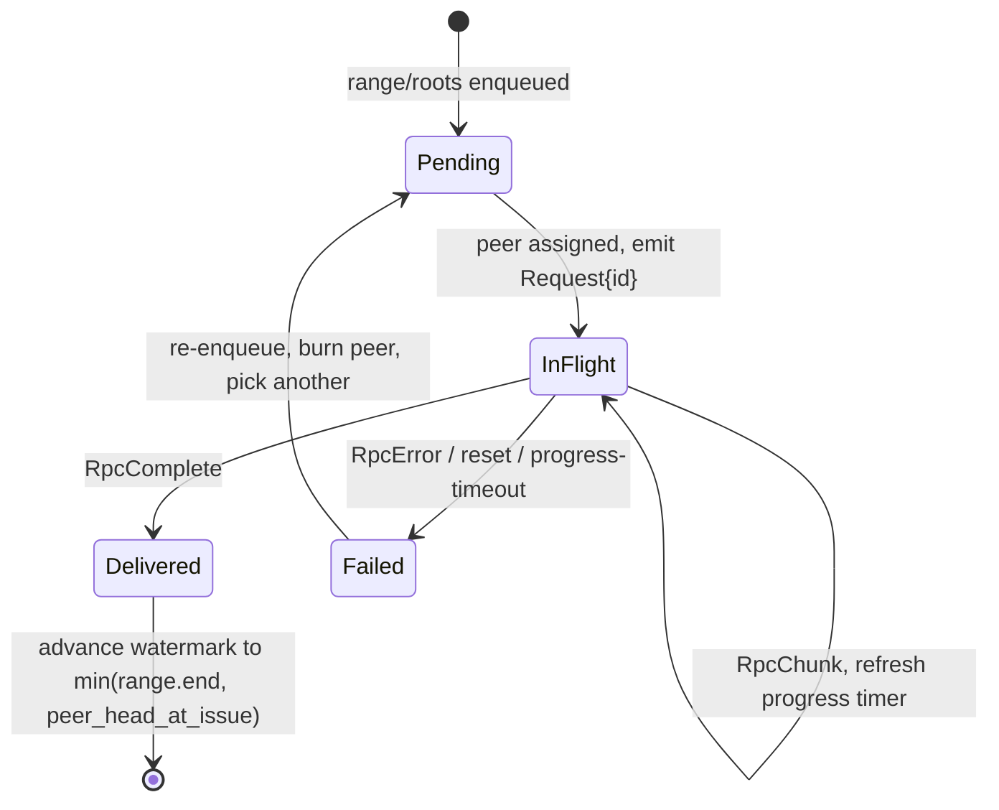
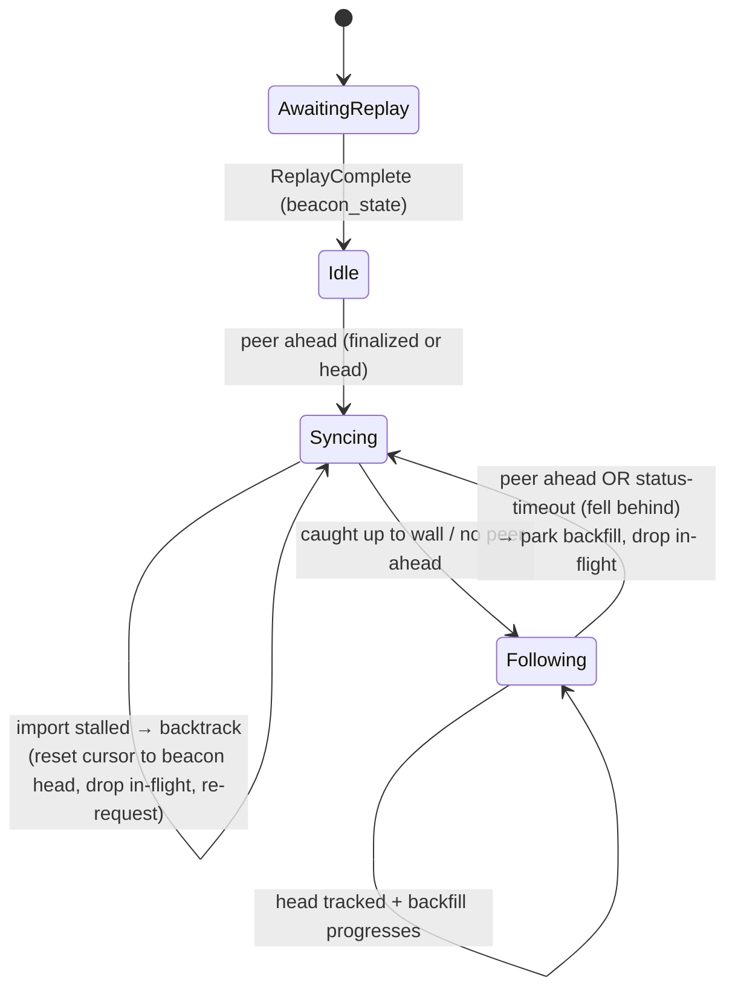

# SyncEngine — unified sync & backfill driver (design)

High-level design for a single component that owns **all** outbound block and
data-column requests — live forward sync *and* historical backfill. Replaces
logic currently split across the peer manager (live targeting + range issuance)
and the storage tile (backfill scheduling + by-root retries). See
`docs/sync-backfill-flow.md` for the current (pre-refactor) flow.

Name `SyncEngine` is provisional.

## Principles

- **Standalone, not a tile.** A plain struct owned by the **control tile**
  (alongside PeerManager + request routing), driven synchronously from its loop.
  Pure `event → actions`: no spine handles, no I/O, only a `now: Instant` passed
  in. Unit-testable in isolation like `scoring.rs`.
- **Strict state machine.** Every outbound request has an explicit lifecycle;
  no implicit/inferred state.
- **Response-driven completion.** A range is complete when its RPC stream
  returns `Complete` (or fails on `Error`/reset) — **never** inferred from
  beacon-state head advancing. This fixes the current bug where a range whose
  tail slots are *skipped* (empty) stalls forever because our imported head
  never reaches the range end (`manager/rpc.rs` `resolve_syncreq`,
  `end_inclusive.min(peer_head)` gated through `local_head_imported_slot`).
- **Bytes never enter the engine.** Block/column payloads continue to flow to
  the storage tile for validation + persist over the existing tcache path. The
  engine consumes only request-lifecycle control signals.
- **Sequenced start.** Forward sync does not begin until `BeaconStateEvent::
  ReplayComplete` (disk replay must finish applying to fork choice first, so
  sync targets off a settled local head).
- **Backfill is owned by the `Following` phase**, not a separate sub-machine —
  it is *unrepresentable* outside `Following`, so it cannot compete for
  bandwidth with catch-up. `Following` is re-entrant: if the node falls out of
  sync (see below) it reverts to `Syncing`, which drops the `Following` value
  and with it all in-flight backfill — backfill is paused for free. Its durable
  cursor is parked in `Ctx` and handed back on re-entry, so it resumes rather
  than restarts.

## API

```rust
fn on_event(&mut self, ev: SyncEvent, now: Instant, emit: &mut impl FnMut(SyncAction));
fn tick(&mut self, now: Instant, emit: &mut impl FnMut(SyncAction)); // retries, timeouts, backtrack
```

## Contract — events in, actions out

```mermaid
flowchart LR
  subgraph inputs["SyncEvent"]
    direction TB
    e1["PeerStatus { peer, head, finalized, earliest_avail, custody }"]
    e2["PeerConnected / PeerDisconnected"]
    e3["RpcChunk { request_id, peer }  (progress only)"]
    e4["RpcComplete { request_id, peer }"]
    e5["RpcError { request_id, peer, code } / RpcStreamReset"]
    e6["BlockRejected { root }  (beacon_state)"]
    e7["LocalStatus { head_slot, finalized }  (beacon_state Status)"]
    e10["ReplayComplete  (beacon_state — gates start of forward sync)"]
    e8["BackfillState { block_floor, earliest_present, column_floor } (storage scan)"]
    e9["ColumnNeed { block_root, slot, missing }  (storage, incremental)"]
  end
  eng["SyncEngine<br/>(strict FSM)"]
  subgraph outputs["SyncAction"]
    direction TB
    a1["RequestBlocksByRange { id, peer, start, count }"]
    a2["RequestColumnsByRange { id, peer, start, count, columns }"]
    a3["RequestColumnsByRoot { id, peer, block_root, columns }"]
    a4["SetSyncTarget(SyncUpdate)"]
    a5["ScorePeer { peer, severity }"]
  end
  inputs --> eng --> outputs
```



The control tile is the sole adapter: it turns each request `SyncAction` into a
routed outbound RPC (PeerManager ranks/picks the peer, applies rate-limit +
in-flight caps), and feeds back `RpcChunk`/`RpcComplete`/`RpcError`. `PeerStatus`
comes from PM's Status aggregation; payloads still go to storage.

## Per-request lifecycle FSM



**Completion semantics (the fix):**
- `RpcComplete` ⇒ responder served all it has in `[start, min(end, peer_head_at_issue)]`
  and closed. Advance the watermark to `min(range.end, peer_head_at_issue)`,
  **decoupled from our import**. Skipped slots inside the span are empty, not
  missing.
- `RpcError` / reset / progress-timeout ⇒ `Failed`: re-enqueue, burn the peer for
  this target, pick another.

## Forward sync + backtrack (reconciliation with beacon-state)

Because completion is decoupled from import, the engine must still reconcile its
optimistic watermark against the chain that beacon-state actually builds, and
not run away from it.



`Syncing` carries `target: Target` (`Finalized { epoch, root }` | `Head { root,
slot }`) rather than splitting into two variants — the cursor logic is identical;
only the stop condition differs. `Following` owns the backfill cursor + in-flight
and the status-timeout watchdog.

Three rules tie the engine to `LocalStatus { head_slot }` (beacon Status). Note
`synced_through > local_head` is the *normal* steady state — the optimistic
watermark is meant to lead import — so it is never on its own a fault; (a) caps
how far it may lead, (b) is purely temporal.

1. **Gap cap (a).** Hard invariant: `synced_through - local_head <=
   MAX_SYNC_AHEAD_SLOTS` (defined constant, ~128). Stop issuing forward ranges
   once issuing one more would push the watermark beyond `local_head +
   MAX_SYNC_AHEAD_SLOTS`; resume as `local_head` advances. Bounds how far
   optimistic sync outruns import (and thus unbounded buffering / divergence
   from the chain actually being built).
2. **Stall timeout (b).** If `synced_through > local_head` **and** `local_head`
   has not advanced for `import_stall_timeout` ⇒ the optimistic watermark is
   wrong (real gap, silently-dropped block, or columns missing for DA). This is
   the *time* dimension only — the gap existing is expected; the gap *not
   closing over time* is the fault signal.
3. **Backtrack.** On stall: reset `synced_through := local_head` (and
   `columns_synced_through` likewise), drop all in-flight forward requests, and
   re-request forward from the **current beacon head**. `BlockRejected` triggers
   the same reset plus blacklisting the offending root (via `ScorePeer` / PM).

`LocalStatus` is used only for the gap cap + stall/backtrack — never to mark a
request complete.

**Following fall-out (4).** `Following` runs its own status watchdog: `LocalStatus`
should arrive ~once per 12 s slot, so its timeout (`following_status_timeout`,
a few slots) is much longer than `Syncing`'s `import_stall_timeout`. If head
stops advancing past that window, or a peer Status shows a target ahead again,
`Following → Syncing`: re-acquire a target and resume forward sync. The dropped
`Following` value parks its backfill cursor in `Ctx` and releases in-flight
backfill requests — backfill is paused until `Following` is re-reached.

*Tuning note:* with `MAX_SYNC_AHEAD_SLOTS = 128` and a 128-slot
`BlocksByRange` batch, ~1 batch may be outstanding ahead of import (forward sync
is closely paced to the importer). Raise `MAX_SYNC_AHEAD_SLOTS` to pipeline more
batches ahead of import at the cost of more buffering and a wider backtrack on
stall.

## Backfill (owned by the `Following` phase)

Backfill is a field of the `Following` state, not an independent sub-machine —
it exists only while `Following` does, and is driven only by `Following::step`.
Seeded by `BackfillState` from storage's startup scan (storage scans, reports,
and no longer schedules). Fills `(floor → anchor]` backward, concurrently with
live head-following, sharing the peer pool + in-flight budget.

- **Columns: range-first, root-fallback.** Contiguous historical gaps go via
  `DataColumnSidecarsByRange` (bulk); sparse stragglers and `ColumnNeed`
  discoveries (block backfill pulling a blob-carrying block into the window) go
  by-root. Bounded concurrency, response-driven completion, wheel retry.
- **Blocks:** `BlocksByRange` backward over the block gap, same lifecycle FSM.
- **Pause/resume.** Leaving `Following` drops the active backfill (in-flight
  requests released); the durable cursor (filled-to, remaining needs) is parked
  in `Ctx` as inert data and re-attached to the next `Following`, so it resumes
  from where it stopped.

- **Columns: range-first, root-fallback.** For contiguous historical gaps, issue
  `DataColumnSidecarsByRange` (bulk — one request spans many slots/columns)
  rather than one `DataColumnsByRoot` per block. Fall back to by-root for sparse
  stragglers and for `ColumnNeed` entries discovered when block backfill pulls a
  blob-carrying block into the window (today's "set 2"). Mirrors the live split
  (PM by-range + storage by-root straggler) but unified here.
- **Blocks:** `BlocksByRange` backward over the block gap, same lifecycle FSM.
- Bounded concurrency (existing `MAX_COLUMN_REQUESTS_IN_FLIGHT`-style cap),
  response-driven completion, wheel-based retry.

## Implementation pattern

The current code is hard to reason about because one flat scope holds many
booleans/watermarks (`target_dirty`, `was_ever_synced`, `synced_through`,
`inflight_syncreq`, …) whose valid combinations are implicit. Target shape: a
state machine where **each phase owns exactly its own variables** and illegal
combinations are unrepresentable.

### Context (mechanism) vs Phase (policy)

Split state into two kinds — this is the core move, not "put everything in the
enum":

- **`Ctx` — mechanism, present in every phase:** peer view, the in-flight
  request table, request-id counter, config, and the *parked* backfill cursor
  (inert between `Following` episodes).
- **`Phase` — policy, valid in one phase only:** the sync target, watermarks,
  stall timers, the *active* backfill. Lives inside the enum variant — cannot be
  named outside it.

```rust
pub struct SyncEngine { ctx: Ctx, phase: Phase }

struct Ctx {
    cfg: SyncConfig,
    peers: PeerView,             // eligibility + ranking (fed by PeerStatus)
    requests: RequestTable,      // in-flight request FSMs, keyed by request_id
    next_id: u64,
    parked_backfill: Option<BackfillProgress>, // durable cursor between Following episodes
}

enum Phase {
    AwaitingReplay,
    Idle,
    Syncing(Syncing),
    Following(Following),
}

struct Syncing {
    target: Target,
    synced_through: u64,
    columns_synced_through: u64,
    last_local_head: u64,
    last_progress_at: Instant,   // import-stall → backtrack timer
}

struct Following {
    last_status_at: Instant,     // status watchdog (longer; ~per-slot)
    backfill: Backfill,          // owned here — unrepresentable elsewhere
}
```

`synced_through` exists only inside `Syncing`; `backfill` only inside
`Following`. Dropping a phase value drops its whole world — no flag can be left
set in the wrong state.

### Transitions consume the phase by value

Each state's `step` takes `self` by value and returns the next `Phase`. Moving
`phase` out of `&mut self` also frees the borrow on `&mut ctx` (same split-borrow
trick as `ColumnBackfill::rotate`):

```rust
pub fn on_event(&mut self, ev: SyncEvent, now: Instant, emit: &mut impl FnMut(SyncAction)) {
    self.ctx.ingest(&ev, now, emit);                 // responses/status update mechanism
    let phase = std::mem::replace(&mut self.phase, Phase::Idle); // own by value
    self.phase = phase.step(&ev, &mut self.ctx, now, emit);      // -> next Phase
}
```

`Syncing::step` returns `Phase::Syncing(self)` (cursor advanced / backtrack) or
`Phase::Following(..)` (caught up). `Following::step` returns itself or
`Phase::Syncing(..)`, handing `self.backfill.into_progress()` to
`ctx.parked_backfill` on the way out. Every transition is one explicit return of
a fully-formed next state — no half-mutated intermediate.

### Per-request lifecycle is its own small FSM, in `Ctx`

Responses arrive addressed by `request_id` and must match regardless of phase, so
requests live in `Ctx.requests`, each tagged by purpose — not in the phase enum
(which would knot the borrow against `ctx`-routed responses):

```rust
struct Request { peer: usize, purpose: Purpose, state: ReqState, last_progress: Instant }
enum ReqState { InFlight, Delivered { up_to: u64 }, Failed }
enum Purpose { ForwardBlocks, ForwardColumns, BackfillBlocks, BackfillColumns }
```

`Ctx::ingest` advances a request's `ReqState` on chunk/`Complete`/`Error`, then
hands the phase a neutral outcome ("ForwardBlocks delivered up to N"); the phase
moves its cursor. Mechanism (which request/peer) in `Ctx`; policy (what the
watermark becomes) in the phase. Backtrack / fall-out does
`ctx.requests.drop(purpose)`.

### Avoid

- **Typestate** (`SyncEngine<Syncing>`) — for compile-time-known sequences; the
  engine is a fixed-type field transitioning at runtime, so it doesn't apply.
- **`Box<dyn State>`** — allocation + dynamic dispatch, loses exhaustive `match`;
  against silver's no-heavy-abstractions / watch-allocation ethos. The enum gives
  the same polymorphism with neither cost.

### Migration order (do the move before the reshape)

1. **Lift-and-shift.** Create `SyncEngine` with a *flat* struct holding today's
   flags moved verbatim out of PM/storage, behind the `on_event`/`tick` API.
   Wire it; keep existing tests green. No behaviour change — this isolates the
   risky cross-tile move from the reshape.
2. **Carve `Ctx` from `Phase`.** Move always-present fields (peers, requests,
   counters) into `Ctx`; leave the rest flat. Mechanical.
3. **Promote `Phase` to enum-of-structs.** Push phase-specific fields into the
   variants; convert flag reads into `match self.phase`; delete the booleans as
   they become unrepresentable. The response-driven-completion fix lands here as
   `Syncing::step` on a delivered outcome (or do it in step 1 against the flat
   struct if you want the correctness fix first).

## The split, after

| Concern | Today | After |
|---|---|---|
| Sync target selection | PM | **SyncEngine** |
| Live range issuance + completion | PM (head-inferred) | **SyncEngine** (response-driven) |
| Backfill range/column planning | storage | **SyncEngine** |
| By-root + by-range request scheduling/retry | storage + PM | **SyncEngine** |
| Backpressure / stall / backtrack vs beacon head | partial (PM) | **SyncEngine** |
| Peer ranking / rate-limit / actual send | PM | **PM** (serves `SyncAction`) |
| Status aggregation (`finalized_counts`) | PM | **PM** → feeds `PeerStatus` |
| Validation, persist, import | storage | **storage** |
| Startup scan → backfill state | storage (drives requests) | **storage** (emits `BackfillState`/`ColumnNeed` only) |

## Resolved decisions

1. **Target selection: in-engine** (coupled to completion + next-range).
2. **Column backfill: `ColumnNeed` events + range-first/root-fallback** request
   strategy (range for contiguous gaps, root for stragglers).
3. **Owned by the control tile** (standalone struct, not its own tile for now).

## Open / to confirm

- `BackfillState` exact encoding of the column-gap set (compact per-slot mask
  vs. run-length over contiguous gaps) — drives whether range-first is cheap.
- `MAX_SYNC_AHEAD_SLOTS` (≈128) and `import_stall_timeout` values (tune against
  devnet).
- Whether forward and backfill share one in-flight budget or get separate caps.

## Migration progress

Three-step plan (see "Implementation pattern → Migration order").

### Step 1 — module + contract — **DONE**

`crates/control/src/sync_engine.rs` (`pub mod sync_engine` in
`crates/control/src/lib.rs`):

- `SyncEvent` / `SyncAction` enums — the full input/output contract, grounded in
  real `silver_common` types (`SyncUpdate`, `RpcSeverity`, roots/slots). This
  surface is now fixed; later steps fill in behaviour, not shape.
- `SyncEngine` — flat struct (pre-reshape). Only live behaviour is the
  `ReplayComplete` start gate (`started()`); all else is `TODO(step 2)`.
- Compiles under `-D warnings`; **not wired** into the control loop, so no
  behaviour change and existing tests stay green.

### Step 2 — lift-and-shift (NEXT)

Move live forward-sync state out of `silver_peer::PeerManager` into `SyncEngine`,
flat (no reshape yet), running in parallel with the existing PM path until parity
is shown. Suggested order, smallest-blast-radius first:

1. **Target selection.** Move the Status aggregation (`finalized_counts` /
   `head_counts`) + `select_target` / `maybe_emit_sync_target` so the engine
   emits `SyncAction::SetSyncTarget`. Control loop feeds it `PeerStatus` (parsed
   from inbound Status) + `LocalStatus` + `ReplayComplete`; forward
   `SetSyncTarget` onto the `sync_target` queue. Keep PM's emitter live and
   assert both produce the same target before deleting PM's.
2. **Forward range issuance + completion.** Move `inflight_syncreq` /
   `synced_through` (blocks) and `col_syncreq` / `columns_synced_through`
   (columns) and the request lifecycle. **Switch completion to response-driven
   here** (`RpcComplete` advances watermark to `min(end, peer_head_at_issue)`),
   the correctness fix — `Syncing::step` on a delivered outcome.
3. **Gap cap + stall/backtrack + Following watchdog.** Wire `LocalStatus` to the
   `MAX_SYNC_AHEAD_SLOTS` gap cap, `import_stall_timeout` backtrack, and the
   longer `following_status_timeout` fall-out.

Routing stays in the control tile: each `SyncAction` request → outbound RPC to
the named peer (existing `allocate_*_by_root` / `RpcRequestOutbound` path),
caps/rate-limit enforced by PM, rejection fed back as `RpcFailed`. PM keeps peer
ranking + scoring + send; the engine selects peers from `PeerStatus`-fed data.

### Step 3 — reshape

Carve `Ctx` (mechanism) from `Phase` (policy); promote `Phase` to the
enum-of-structs (`AwaitingReplay` / `Idle` / `Syncing` / `Following`), backfill
owned by `Following`. Delete the booleans that become unrepresentable. Then move
backfill scheduling out of the storage tile (storage → scan + `BackfillState` /
`ColumnNeed` only), and add the column-backfill range-first path.

**Parity discipline (steps 2–3):** keep the PM/storage path alive behind the new
engine until a devnet run shows identical sync/backfill behaviour, then delete.
Must-cover tests: skipped-slot range completion, gap-cap backpressure,
import-stall backtrack, `Following` fall-out → resume (not restart) backfill.
