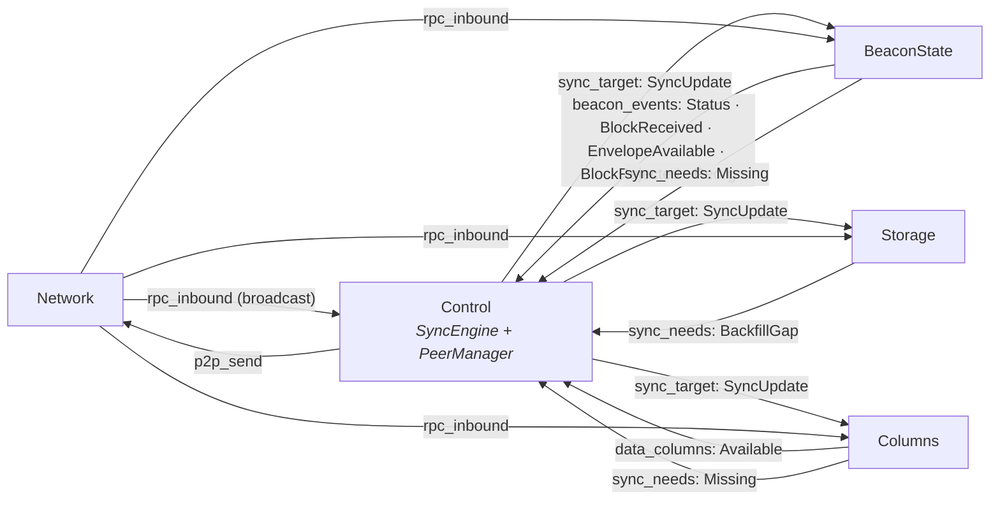

# Syncing

How silver goes from a cold start to the chain head, and back if it falls behind. This doc gives the division of work between the tiles. For the full queue topology, see [spine message flow](spine-message-flow.md).

## 1. Tiles responsibilities

**Each tile reports facts about its own domain. Only the sync engine makes requests from those facts.**

| Tile | Owns | Never does |
|---|---|---|
| **control** | *All sync policy.* The **sync engine** selects the data to get, and decides if we are synced. The **peer manager** selects the peer for each request, and owns request liveness. | Touch state or disk |
| **beacon_state** | Blocks, envelopes, fork choice, the canonical head. Reports what it applied, parked, or refused. | Select the data to get |
| **storage** | Blocks, columns and envelopes on disk. Knows which history is missing, and the `earliest_available_slot` that we claim to serve. | Select the data to get |
| **columns** | Sidecar validation. Decides when the data of a block is available. | Select the data to get |
| **network** | The wire (QUIC + discv5). | Anything sync-shaped |

The policy is in one tile. Thus the other tiles stay thin. Each one monitors its own domain, but holds no request, no retry timer, and no view of the sync progress.

## 2. Messages



Three channels carry the protocol:

- **`sync_needs`** — the one "I need X" / "I have X" channel, from three tiles. `Missing { root, slot, kind, columns, origin }`, `Arrived { root, .. }`, and `BackfillGap { kind, floor, next }`.
- **`beacon_events`** — chain facts. `BlockReceived { slot, root, parent_slot, applied }` is the important one. `applied` shows the difference between *we hold it* and *it is in the chain*. `parent_slot` is the proof for the engine that the slots between are empty.
- **`sync_target`** — the one decision that the engine publishes. It puts each other tile into the correct mode.

`rpc_inbound` is a **broadcast**. Each tile sees each response, and filters on the `(kind, origin)` pair of the request id. Each tile takes only the data that it requested. Live blocks go to the beacon state tile, backfill blocks to the storage tile, live columns to the columns tile. That filter is the routing contract. It keeps a response out of a tile that did not request it. Without the filter, each foreign object costs a tcache acquire and an import attempt.

Two tiles can need one object. One pair is shared on purpose: `(Block, Live)` goes to the beacon state tile *and* to the columns tile. The columns tile needs the block before the beacon state tile makes a decision on it. If not, a block that waits for columns never gets to the tile that requests them.

## 3. Sync engine target

`select_target` (`sync_engine/select.rs`) is a pure function of the local status, the peer statuses, and the block gap of the window. It gives one `SyncUpdate`:

- `SyncingFinalized { epoch, root }` — a finalized checkpoint of a peer in front of us
- `SyncingHead { root, slot }` — the head of a peer, if no checkpoint is applicable
- `Following` — there is nothing better to get

The target is sticky. The engine keeps it while the node did not reach it, peers still back it, and it is not excluded. The `Phase` of the engine agrees with the target — `Idle` / `Syncing` / `Following` — and owns the state of that phase. `Ctx` holds the facts that stay longer than one target: the config, the peer and local views, the backfill cursors, and the by-root needs. The `SyncWindow` is next to `Ctx` on the engine, because it is a ledger for the current target. Both phases write to it, and a new target initializes it again. Selection runs only after a change to its inputs. The engine publishes the target once for each real change.

## 4. Syncing: the window

The `SyncWindow` is a ring of 128 slots (`FETCH_CEILING = 2 × BATCH`) above the tail. For each slot it holds three facts:

```
Coverage { block: Unknown | Empty | Parked | Applied,
           columns_covered: bool,
           envelope_covered: bool }
```

Two derived questions control the behaviour:

- **`owes(kind, slot)`** — what to get. A block if the block is `Unknown`. Columns if we have custody of them and the slot is above the data-availability floor. An envelope if the slot is after the Gloas fork. An `Empty` slot owes nothing.
- **`complete(slot)`** — if the tail can go past the slot. The block must be `Empty` or `Applied`, and nothing must be outstanding.

The difference between `Parked` and `Applied` is important. A slot can hold more than one block. Thus a block that we hold prevents a second request, but settles nothing. Only an apply settles a slot. Thus the tail can not go past a slot that the chain is not built on. `Applied` never changes back: a sibling that parks later tells nothing about the block that applied.

The tail is the mark of completed work: all slots at the tail and below it are done. The applied head of the beacon state tile *starts* the tail — at the first status, and again after a replay, where the beacon state tile applies a full tree and the window sees no slot of it. But the applied head never moves the tail down. An apply above the tail is progress on one chain, not proof about the slots between. Thus, after the start, only coverage in the window moves the tail up. Finality is the one other input that moves the tail up. The beacon state tile refuses a block before finality, thus no request can settle a slot below finality. Each write of the tail is clamped to finality.

One cycle uses four tiles:

1. The **control** tile finds the lowest slot above the tail that owes data, and sends a range request. A range has a maximum of 64 slots. One request for each kind can be in flight, thus a maximum of three.
2. The peer manager in the **control** tile selects a peer that claims that span and has spare capacity. The **network** tile sends the request.
3. The responses come in. **beacon_state** applies or parks each block, then reports it. **columns** validates the sidecars, then reports `Available`.
4. **control** puts those reports into the window. The tail moves across the consecutive complete slots.

Three guards keep the tail correct. All three are in the engine:

- **Proof of emptiness.** A block range can complete and give no block below slot X. Then the engine marks those slots `Empty`, up to the last block that came in — or across the full range, if the peer claimed to hold that span.
- **Escalation after a stall.** If the tail stops, the engine escalates. After 8 s it looks for more peers. After 32 s it marks the chain unavailable, thus selection tries a different chain.
- **Settlement.** The end of a response shows that the peer is done, not that the tiles are done. The engine counts the objects from the wire against the reports from the tiles, and holds the span while a tile still owes one. Thus the engine never asks for a range again while a tile verifies it. `SETTLE_TIMEOUT` (2 s of silence) is the backup, because one `Available` for each slot does not agree with many sidecars for each slot.

A change to a different chain discards the ranges in flight **and** initializes the window again at the imported head of the beacon state tile. Coverage uses the slot as the key, and a slot number tells nothing about the branch that filled it. The window is a work ledger for the current target, not a record of a branch. Thus no data above that floor is applicable.

## 5. Backfill

The storage tile knows which history is missing, because it writes the history. After each write it sends a **level-triggered** `BackfillGap { kind, floor, next }`, which replaces the cursor in the engine.

Thus the engine holds one cursor pair and one settling span for each kind — three independent walks down the chain (blocks, columns, envelopes). The backfill state is O(1) for all quantities of history, and one mechanism covers all three kinds.

**Storage confirms completion; the peer does not.** After a range comes in, the engine waits for a report from the storage tile. After `SETTLE_TIMEOUT` of silence, the engine asks for the range again. This finds a peer that ended a range but served only a part of it. The storage tile can not link across the hole, and backfill data goes to no other tile that could find it. Thus a "done" from the peer has no value here.

Columns backfill uses a range, not a root, for the same reason as blocks. The storage tile paces its disk scan, thus the owed set stays a small and dense window. One range covers such a window efficiently, and the state of the engine stays constant.

## 6. Following

In `Following` the window continues to get data. Gossip blocks come in as `BlockReceived`, and availability as `Available`. Thus the window stays a live picture of the head region.

From the window the engine calculates `block_gap`: the consecutive slots above the tail with no block and no proof of emptiness, up to the wall slot. That is different from "behind on data" and from "the chain is quiet". A single "are we behind" flag would mix those three conditions. Above `head_lag_threshold_slots` (8), `fell_behind()` becomes true, selection runs again, and the engine goes back to `Syncing`.

## 7. Requests by root

A slot range can not name some of the gaps: the missing parent of a block, the missing columns of a parked block, or a missing envelope. **beacon_state**, the **columns** tile and **storage** send `Missing { root, slot, kind }` on `sync_needs`. When the object comes in, `Arrived` removes the need.

The same division is applicable here. Those tiles report what blocks them. The engine decides if, how frequently and how to request it. The set has a limit of `max_parents` 64 and `max_dc` 512. The engine applies that limit; it does not use the limits of the emitters, because the need of the storage tile has no pending buffer behind it. At the limit the engine discards the newest need. The engine serves the needs oldest-first, because the oldest need is the need that may be blocking the tail.

## 8. Startup syncing strategy

The engine compares the data on disk with the peer statuses, then sends a `SyncingStrategy`: replay the fork tree on disk, or do not replay it because the peers are finalized in front of us. The engine decides in 15 s after the first local status — immediately, if the peers are clearly in front. The storage tile obeys the strategy and streams `replay_blocks` into the beacon state tile, which then reports `ReplayComplete`.

Only then does the engine start to send requests. The replay time has no limit, because it depends on the size of the tree on disk. Thus a timeout here would occur during a replay, and the engine would compete with the beacon state tile for the same slots.

## 9. Code

```
crates/control/src/sync_engine/
├── mod.rs          Phase, Ctx, event intake, the dirty/advance cycle
├── select.rs       select_target — pure target choice
├── syncing.rs      the Syncing phase: range issuance, tail advance, stall escalation
├── sync_window.rs  the 128-slot coverage ring
├── backfill.rs     three RangeWalks over storage-reported gaps
├── by_root.rs      live single-object chasing
└── peers.rs        peer status aggregation, exclusions

crates/peer/src/manager/rpc.rs   request placement, fan-out, liveness, rate limits
crates/common/src/request.rs     SyncRequest / RequestId — the one request taxonomy
crates/common/src/spine/messages.rs   SyncNeed, SyncUpdate, BeaconStateEvent
```
